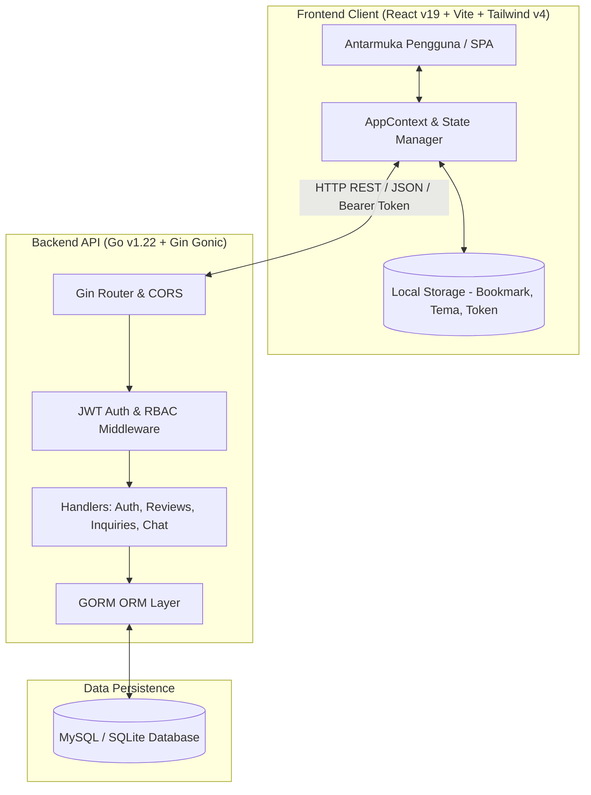
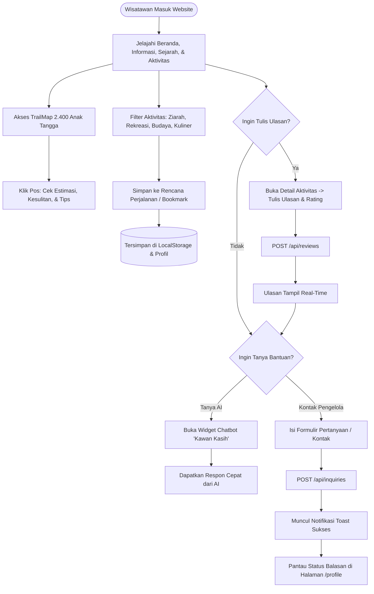
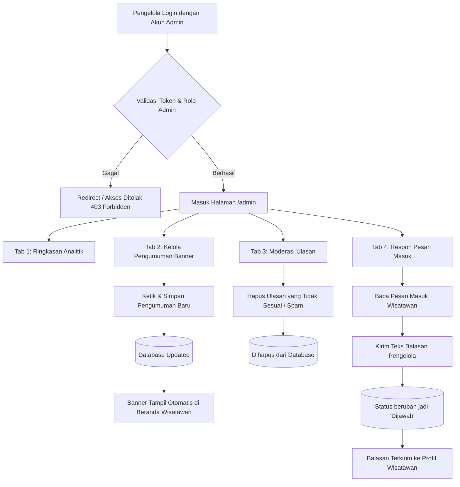
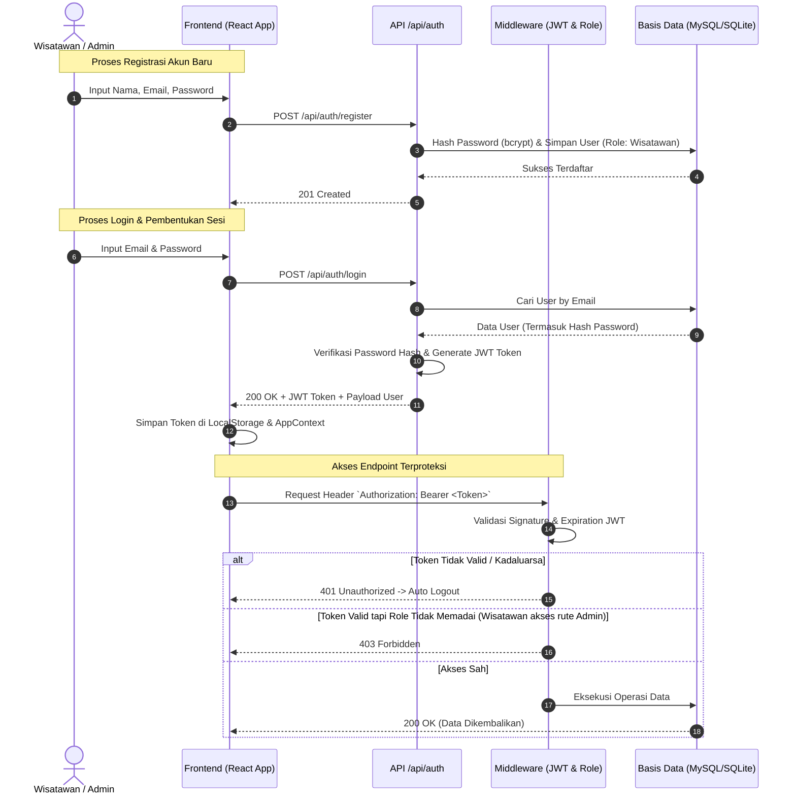
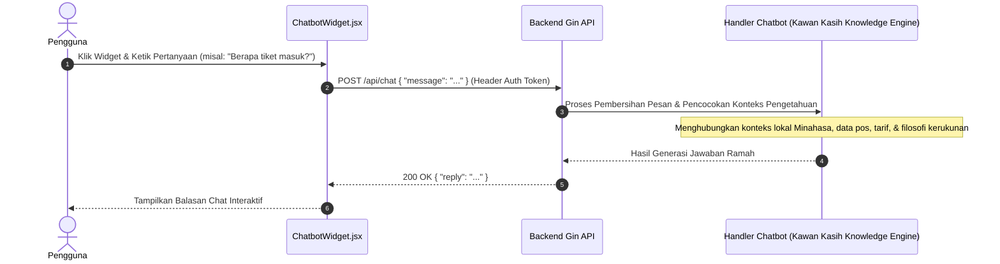
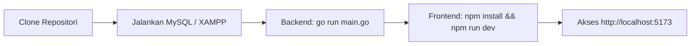
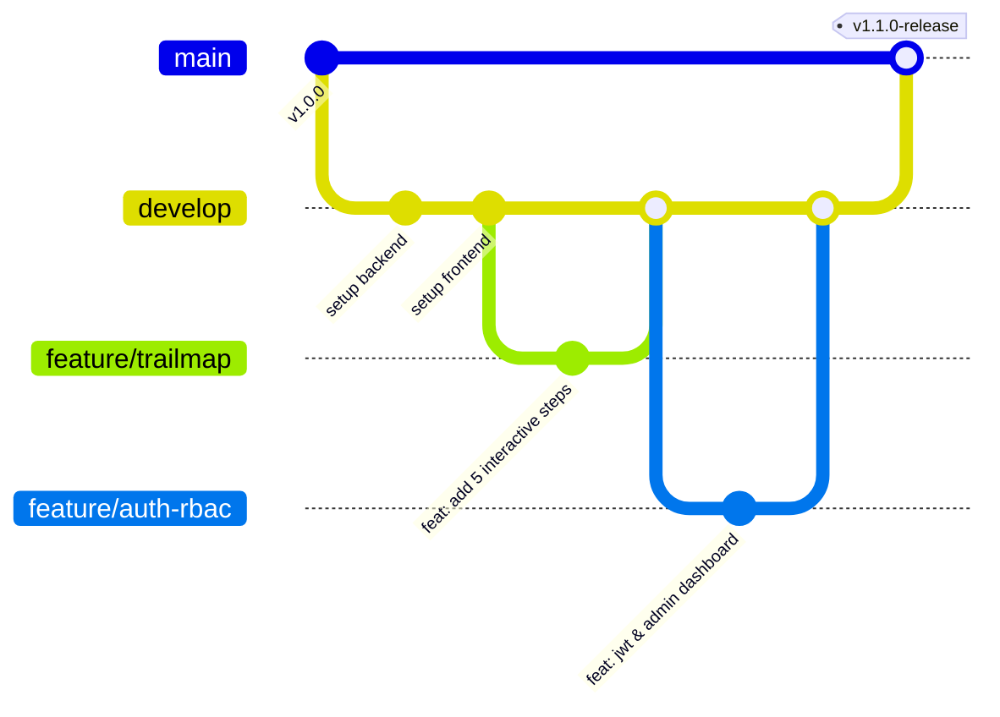

# Alur Kerja & Standar Operasional Sistem (Workflow)
## Website Portal Informasi & Panduan Wisata Bukit Kasih Kanonang

Dokumen ini memuat panduan komprehensif mengenai seluruh alur kerja (*workflow*) sistem website **Bukit Kasih Kanonang**, mencakup alur interaksi pengguna (wisatawan & pengelola), alur autentikasi dan keamanan, alur data/API, serta standar alur kerja pengembangan perangkat lunak (*software development lifecycle*).

---

## 📑 Daftar Isi
1. [Arsitektur Sistem & Alur Komunikasi Data](#1-arsitektur-sistem--alur-komunikasi-data)
2. [Alur Kerja Wisatawan (Tourist Workflow)](#2-alur-kerja-wisatawan-tourist-workflow)
3. [Alur Kerja Pengelola / Admin (Admin Workflow)](#3-alur-kerja-pengelola--admin-admin-workflow)
4. [Alur Kerja Autentikasi & Otorisasi (Auth & RBAC)](#4-alur-kerja-autentikasi--otorisasi-auth--rbac)
5. [Alur Kerja Asisten Virtual AI (Chatbot "Kawan Kasih")](#5-alur-kerja-asisten-virtual-ai-chatbot-kawan-kasih)
6. [Matriks Endpoint API & Alur Respon](#6-matriks-endpoint-api--alur-respon)
7. [Alur Kerja Pengembangan & Rilis (Developer & Git Workflow)](#7-alur-kerja-pengembangan--rilis-developer--git-workflow)

---

## 1. Arsitektur Sistem & Alur Komunikasi Data

Sistem dibangun menggunakan pola arsitektur *Decoupled Client-Server* (Frontend SPA dan Backend RESTful API):



---

## 2. Alur Kerja Wisatawan (Tourist Workflow)

Wisatawan dapat mengakses portal informasi pariwisata baik dalam status publik (tamu) maupun setelah masuk (*logged in*).



### Rincian Tahapan Wisatawan:
1. **Eksplorasi Informasi & Rute (TrailMap):** Wisatawan mempelajari 5 pos rute ikonik Bukit Kasih dengan visual interaktif dan tips keamanan.
2. **Kustomisasi Tampilan:** Beralih antara *Light Mode* dan *Dark Mode* sesuai kenyamanan mata (disimpan permanen di memori browser).
3. **Rencana Perjalanan (Itinerary Planner):** Memilih dan menandai (*bookmark*) destinasi untuk dikunjungi.
4. **Memberikan Feedback:** Memberikan rating (1-5 bintang) dan opini ulasan pada objek wisata tertentu.
5. **Mengirim Pertanyaan:** Mengisi form pesan masuk untuk ditindaklanjuti oleh pengelola wisata.

---

## 3. Alur Kerja Pengelola / Admin (Admin Workflow)

Pengelola wisata memiliki hak istimewa (*Admin Role*) untuk memantau metrik dan mengontrol konten dinamis melalui Dashboard Pengelola (`/admin`).



---

## 4. Alur Kerja Autentikasi & Otorisasi (Auth & RBAC)

Sistem menggunakan standar autentikasi **JSON Web Token (JWT)** dengan enkripsi kata sandi menggunakan **bcrypt**.



---

## 5. Alur Kerja Asisten Virtual AI (Chatbot "Kawan Kasih")

Widget asisten virtual AI terintegrasi di sudut layar untuk menjawab pertanyaan seputar sejarah, tiket, rute, dan etika wisata di Bukit Kasih Kanonang.



---

## 6. Matriks Endpoint API & Alur Respon

| Kelompok | Method | Endpoint | Tingkat Akses | Deskripsi & Dampak |
| :--- | :--- | :--- | :--- | :--- |
| **Health** | `GET` | `/api/health` | Publik | Pengecekan ketersediaan server API |
| **Auth** | `POST` | `/api/auth/register` | Publik | Pendaftaran akun wisatawan baru |
| **Auth** | `POST` | `/api/auth/login` | Publik | Validasi kredensial & penerbitan token JWT |
| **Auth** | `GET` | `/api/auth/profile` | Terautentikasi | Mengambil profil user aktif |
| **Pengumuman**| `GET` | `/api/announcements/active` | Publik | Mengambil pengumuman banner aktif |
| **Pengumuman**| `POST` | `/api/announcements` | **Admin Saja** | Menerbitkan/memperbarui pengumuman beranda |
| **Ulasan** | `GET` | `/api/reviews` | Publik | Mengambil semua ulasan wisatawan |
| **Ulasan** | `POST` | `/api/reviews` | Publik / User | Menambahkan ulasan dan rating baru |
| **Ulasan** | `DELETE`| `/api/reviews/:id` | **Admin Saja** | Menghapus ulasan yang melanggar ketentuan |
| **Pesan** | `POST` | `/api/inquiries` | Publik / User | Mengirim pesan pertanyaan dari form kontak |
| **Pesan** | `GET` | `/api/inquiries` | **Admin Saja** | Mengambil seluruh daftar pesan masuk |
| **Pesan** | `GET` | `/api/inquiries/user/:email` | Terautentikasi | Riwayat pesan berdasarkan email wisatawan |
| **Pesan** | `PUT` | `/api/inquiries/:id/reply` | **Admin Saja** | Menulis dan menyimpan balasan pesan |
| **Chatbot** | `POST` | `/api/chat` | Terautentikasi | Tanya jawab dengan AI Kawan Kasih |

---

## 7. Alur Kerja Pengembangan & Rilis (Developer & Git Workflow)

### 7.1 Setup Lingkungan Lokal (Local Setup)



1. **Persiapan Database:**
   - Nyalakan **Apache & MySQL** di XAMPP.
   - Buat database: `bukit_kasih` pada phpMyAdmin.
2. **Menjalankan Backend (Port 8080):**
   ```bash
   cd backend
   go run main.go
   ```
3. **Menjalankan Frontend (Port 5173):**
   ```bash
   cd frontend
   npm install
   npm run dev
   ```

### 7.2 Standar Git Branching & Commit



* **Format Pesan Commit:**
  * `feat:` Menambahkan fitur baru (contoh: `feat: integrasi chatbot ai kawan kasih`)
  * `fix:` Memperbaiki kutu/bug (contoh: `fix: perbaikan sinkronisasi state ulasan`)
  * `docs:` Perubahan dokumentasi (contoh: `docs: update workflow dan panduan instalasi`)
  * `refactor:` Restrukturisasi kode tanpa mengubah fungsionalitas.

### 7.3 Jaminan Mutu Kode (QA & Code Validation)

Sebelum melakukan build atau deployment, jalankan serangkaian validasi berikut:

1. **Pemeriksaan Linter Frontend:**
   ```bash
   cd frontend
   npm run lint
   ```
   *(Pastikan status 0 error dan 0 warning)*

2. **Pengujian Build Produksi:**
   ```bash
   cd frontend
   npm run build
   ```
   *(Memastikan bundler Vite berhasil menghasilkan artefak direktori `dist`)*

3. **Uji Ketergunaan (Usability Testing):**
   - Instrumen: *System Usability Scale (SUS)* dengan 10 butir pertanyaan terstandar.
   - Target Responden: Calon wisatawan dan pemerhati budaya (minimal 30 responden).
   - Metrik Keberhasilan: Skor SUS $\ge 70$ (Kategori *Good/Acceptable*).

---

> **Bukit Kasih Kanonang Web System** — Dikelola untuk pelestarian budaya toleransi, kenyamanan wisatawan, dan riset teknologi informasi pariwisata.
