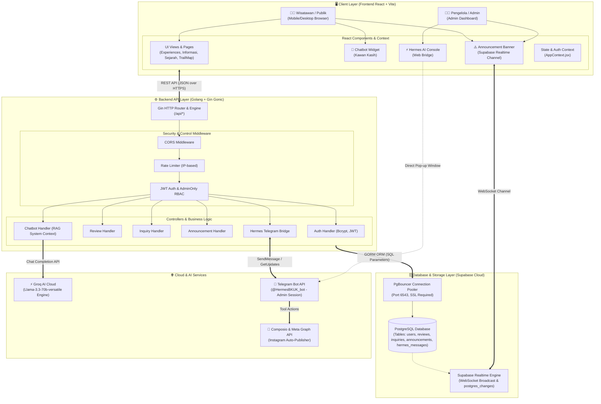

# 🏛️ 01. Diagram Arsitektur Sistem
## Sistem Informasi Pariwisata Bukit Kasih Kanonang & AI Assistant Hub

Dokumen ini menjelaskan arsitektur tingkat tinggi (*High-Level Architecture*) dari sistem web Bukit Kasih, interaksi antar subsistem, dan integrasi layanan cloud eksternal.

---

### 1. Diagram Arsitektur Keseluruhan (Mermaid)

---

### 2. Penjelasan Komponen Arsitektur

#### A. Client Layer (Frontend)
1. **Pariwisata Publik**: Menghadirkan antarmuka responsif bagi wisatawan untuk eksplorasi rute tangga seribu ([`TrailMap.jsx`](file:///c:/Users/slarkboy/OneDrive/Documents/Website%20Bukit%20kasih/Bukit-Kasih/frontend/src/components/TrailMap.jsx)), membaca sejarah budaya, melihat ulasan, dan mengajukan pertanyaan.
2. **Kawan Kasih (Chatbot Widget)**: Asisten AI floating berbasis Groq Llama 3.3 yang siap menjawab pertanyaan wisata secara interaktif.
3. **Announcement Banner**: Menerima peringatan cuaca/jalur darurat secara *realtime* tanpa perlu reload halaman.
4. **Admin Dashboard & Hermes AI Studio**: Panel pengelola terproteksi RBAC untuk moderasi ulasan, menjawab pesan masuk, menyiarkan pengumuman, dan meluncurkan *bridge* percakapan dengan Hermes AI.

#### B. API Gateway & Logic Layer (Backend)
1. **Gin Gonic Engine**: Menangani *routing* berkecepatan tinggi dengan alokasi memori minimal.
2. **Middleware Pipeline**: Memastikan keamanan melalui validasi CORS, Rate Limiting (10 req/min pada endpoint sensitif), pemeriksaan JWT token, dan pembatasan hak akses `AdminOnly`.
3. **Domain Handlers**: Mengisolasi logika bisnis autentikasi, ulasan, FAQ, pengumuman, dan integrasi AI.

#### C. Database Layer (Supabase PostgreSQL)
1. **PostgreSQL Relasional**: Menyimpan seluruh entitas data secara terstruktur dengan constraint integritas (Unique, Not Null, Indexes).
2. **PgBouncer Pooler**: Mengelola *connection reuse* (MaxIdle: 10, MaxOpen: 100) sehingga kebal terhadap lonjakan traffic.
3. **Realtime WebSocket**: Memfasilitasi komunikasi pub/sub instan dari database ke seluruh browser wisatawan yang sedang aktif.

#### D. External Cloud & AI Ecosystem
1. **Groq AI**: Menyediakan inferensi LLM Llama 3.3 70B dengan latensi sangat rendah (~300-500 token/detik).
2. **Telegram Bot API (`@HermesBKUK_bot`)**: Kanal interaksi personal bagi admin pengelola untuk memberikan instruksi pembuatan konten pemasaran digital.
3. **Composio / Meta Graph API**: Mengeksekusi penerbitan konten (post foto dan caption) ke akun Instagram resmi Bukit Kasih setelah disetujui (*Human-in-the-Loop*).
