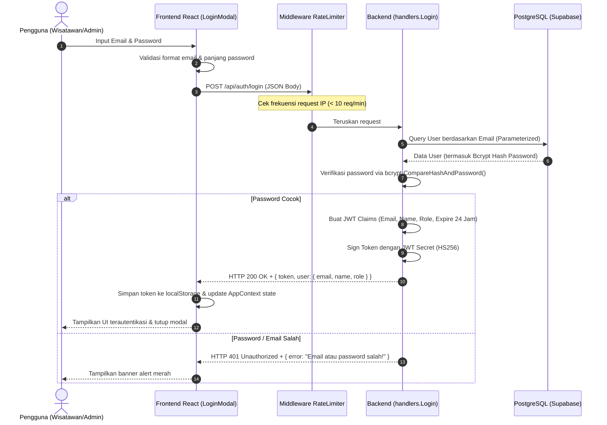
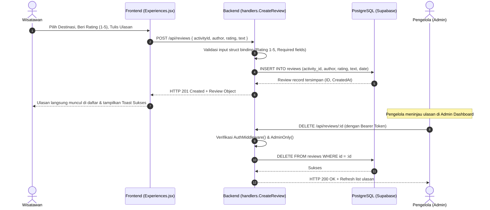
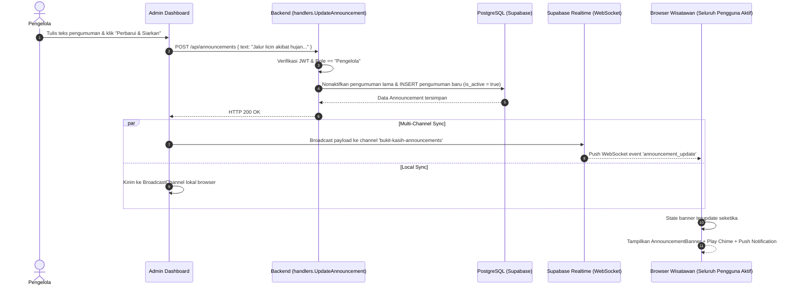
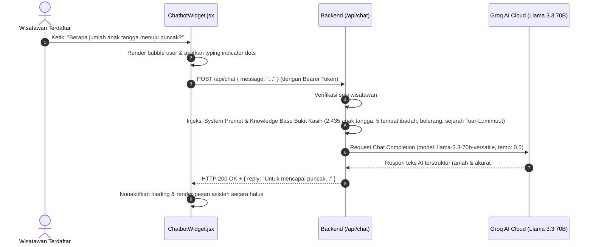
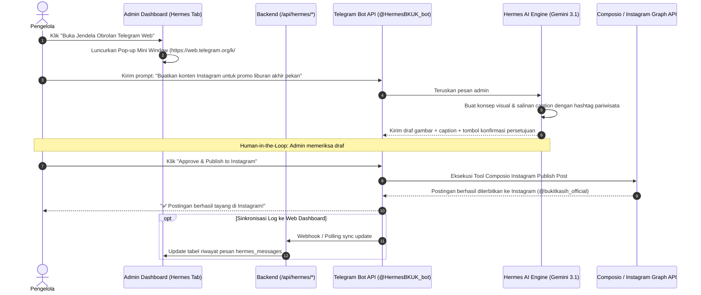

# 🔄 03. Penjelasan Data Flow Sistem
## Sistem Informasi Pariwisata Bukit Kasih Kanonang & AI Assistant Hub

Dokumen ini menguraikan bagaimana data mengalir dari input pengguna pada antarmuka web, diproses oleh API backend, divalidasi, disimpan ke database, hingga didistribusikan ke layanan eksternal.

---

### 1. Alur Autentikasi & Penerbitan Token (Login Flow)

---

### 2. Alur Pengiriman & Moderasi Ulasan (Review Flow)

---

### 3. Alur Siaran Peringatan Realtime (Emergency Announcement Broadcast)

---

### 4. Alur Percakapan Chatbot AI (Kawan Kasih)

---

### 5. Alur Asisten Pemasaran Hermes AI Studio & Instagram Auto-Publish

