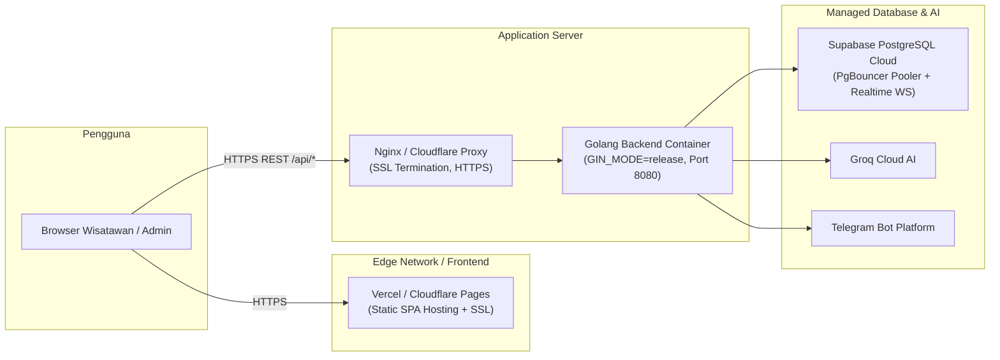

# 🚀 07. Rencana Deployment & Monitoring Pasca-Rilis
## Sistem Informasi Pariwisata Bukit Kasih Kanonang & AI Assistant Hub

Dokumen ini memuat panduan deployment ke lingkungan *production*, konfigurasi server, serta strategi pemantauan keandalan (*monitoring, error rate, & uptime alerting*).

---

### 1. Rencana Arsitektur Deployment



---

### 2. Konfigurasi Lingkungan Produksi (*Production Environment*)

| Variabel Environment | Nilai Produksi (Contoh) | Deskripsi |
|:---|:---|:---|
| `GIN_MODE` | `release` | Mengaktifkan optimasi performa Gin dan menonaktifkan debug logging internal. |
| `PORT` | `8080` | Port listen server backend. |
| `DB_DRIVER` | `postgres` | Driver database PostgreSQL. |
| `DB_SOURCE` | `postgresql://postgres.[id]:[pass]@[pooler-host]:6543/postgres?sslmode=require` | String koneksi terenkripsi SSL ke Supabase PgBouncer. |
| `JWT_SECRET` | *(Random 64-char string)* | Kunci rahasia berkekuatan tinggi untuk sign JWT. |
| `GROQ_API_KEY` | `gsk_...` | API Key resmi Groq AI Cloud. |
| `TELEGRAM_BOT_TOKEN` | `YOUR_TELEGRAM_BOT_TOKEN` | Token bot Telegram `@HermesBKUK_bot`. |
| `TELEGRAM_ADMIN_CHAT_ID` | `YOUR_TELEGRAM_ADMIN_CHAT_ID` | ID Chat Telegram admin yang berwenang. |

---

### 3. Monitoring & Uptime Health Check

#### A. Endpoint Pemantauan Uptime
* **URL**: `GET https://[domain-backend]/api/health`
* **Response Normal**: HTTP `200 OK`
* **Payload**:
  ```json
  {
    "status": "ok",
    "message": "Bukit Kasih Backend API is running successfully!"
  }
  ```

#### B. Integrasi Layanan Monitoring
1. **Uptime Monitoring (UptimeRobot / BetterUptime / Cron)**:
   * Melakukan *ping* berkala setiap 60 detik ke endpoint `/api/health`.
   * Jika respon selain 200 atau *timeout* > 3 detik, sistem otomatis mengirim notifikasi instan ke Telegram/Email administrator.
2. **Database Health**:
   * Memantau kuota *connection pool* (MaxOpen: 100) dan penggunaan CPU melalui *Supabase Dashboard Metrics*.
3. **Application Logs**:
   * Output log `gin.Logger()` dan error handler diarahkan ke log aggregator (seperti Grafana Loki atau PaperTrail) untuk memudahkan analisis histori *error rate*.
