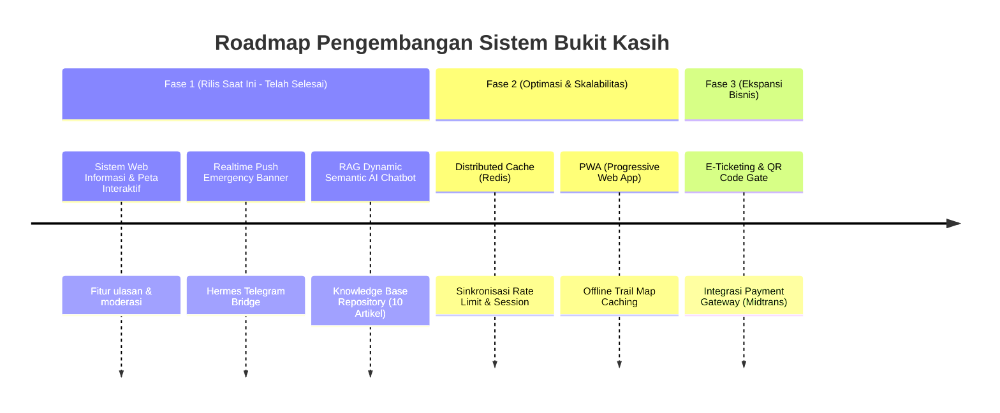

# 🗺️ 08. Known Limitations & Roadmap Pengembangan
## Sistem Informasi Pariwisata Bukit Kasih Kanonang & AI Assistant Hub

Dokumen ini mencatat batasan teknis (*known limitations*) yang ada pada rilis saat ini secara objektif dan transparan, beserta rencana strategis perbaikan (*development roadmap*) di masa mendatang.

---

### 1. Daftar Batasan Sistem Saat Ini (*Known Limitations*)

| No | Area / Modul | Batasan Teknis Saat Ini | Dampak |
|:---:|:---|:---|:---|
| 1 | **Rate Limiter Storage** | Penyimpanan rate limit menggunakan *in-memory Go sync.Map* pada instans server aktif. | Jika backend di-*scale out* ke multi-replica server di balik load balancer, kuota rate limit terhitung per instans (belum tersentralisasi). |
| 2 | **Koneksi Jaringan Pegunungan** | Sistem memerlukan koneksi internet aktif untuk memuat gambar dan peta interaktif. | Wisatawan di titik lembah kawah belerang dengan sinyal seluler lemah mungkin mengalami keterlambatan *loading* aset. |
| 3 | **Pemesanan Tiket Wisata** | Sistem saat ini berfokus pada informasi, navigasi jalur, ulasan, FAQ, serta asisten AI, belum mencakup modul *payment gateway* tiket online. | Pembelian tiket masuk Bukit Kasih masih dilakukan secara langsung di loket fisik gerbang masuk. |

---

### 2. Roadmap Rencana Pengembangan Masa Depan (*Actionable Improvements*)

#### Rincian Rencana Aksi:

1. **Implementasi Redis untuk Distributed Rate Limiting & Session**
   * Menggantikan in-memory map dengan Redis instance (Upstash / Redis Cloud) untuk mendukung *horizontal scaling* multi-server tanpa batas.
2. **Implementasi Progressive Web App (PWA) & Offline Mode**
   * Menambahkan *Service Worker* dan *IndexedDB* untuk menyimpan data jalur pendakian tangga seribu secara *offline*, sehingga peta tetap dapat dibuka wisatawan di lokasi kawah belerang yang minim sinyal seluler.
3. **Modul E-Ticketing & Pembayaran Digital**
   * Mengintegrasikan Payment Gateway (Midtrans/Xendit) untuk pembelian tiket masuk dan sewa pakaian adat Minahasa secara online dengan QR Code validator di pintu masuk.
